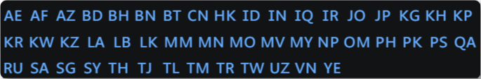
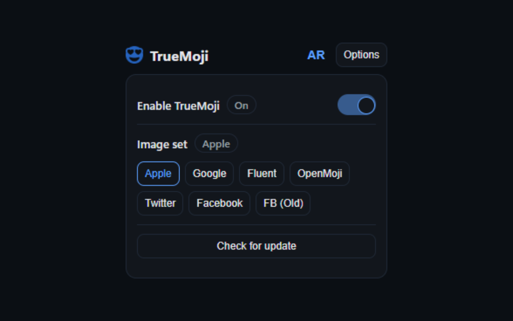
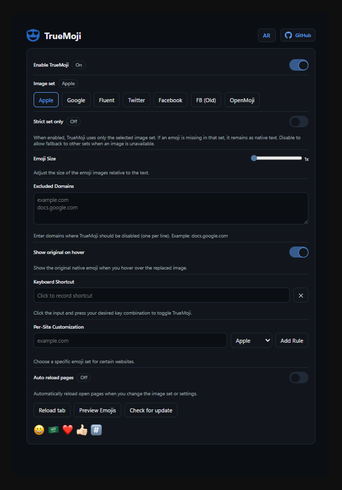

  
  <h1>TrueMoji</h1>

  
  

  <a href="README_ar.md">🇸🇦 العربية</a>

Tired of boring default browser emojis? Or seeing empty squares where flags should be? **TrueMoji is the solution.**

TrueMoji replaces native system emojis with beautiful, high-quality image sets like Apple (iOS), Google, Twitter, and more. Enjoy a consistent, vibrant, and fully expressive emoji experience on every website you visit.

## See the Difference
| Before (Default System) | After (TrueMoji - Apple Style) |
|:-----------------------:|:------------------------------:|
|  |  |

## Features
- **Multiple Emoji Sets**: Choose between Apple, Google, Twitter, Facebook, OpenMoji, JoyPixels, Samsung, Noto Color, and Microsoft Fluent (3D).
- **Per-Site Customization**: Assign different emoji sets to specific websites (e.g., Twitter emojis on Twitter, Apple emojis elsewhere).
- **Excluded Domains**: Disable TrueMoji completely on specific websites.
- **Keyboard Shortcut**: Toggle the extension on/off instantly with a customizable shortcut.
- **Show Original on Hover**: Hover over any emoji to see the original native character.
- **Emoji Size Control**: Adjust the size of emojis from 1.0x to 1.5x.
- **Strict Mode**: Force use of selected set only.
- **Auto Reload**: Automatically refresh pages when settings change.
- **Bilingual**: Fully localized in English and Arabic.
- **Dark Mode**: Settings interface adapts to your system theme.

## Screenshots

### Quick Settings

### Options Page

## Support
If you encounter any issues or have suggestions, please open an issue on GitHub:
[Report an Issue](https://github.com/voidksa/TrueMoji/issues)

## Privacy
For information on how we handle your data, please review our [Privacy Policy](PRIVACY.md).

## License
This project is licensed under the [MIT License](LICENSE).
You are free to fork and improve this project, but you must provide appropriate credit to the original author (**voidksa**) and link back to the original repository [voidksa/TrueMoji](https://github.com/voidksa/TrueMoji).
