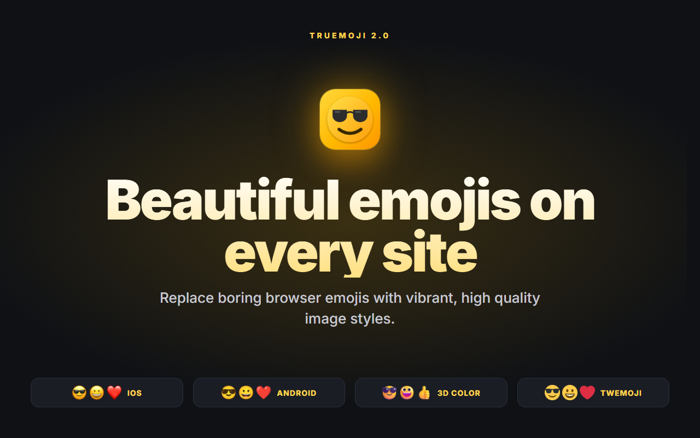
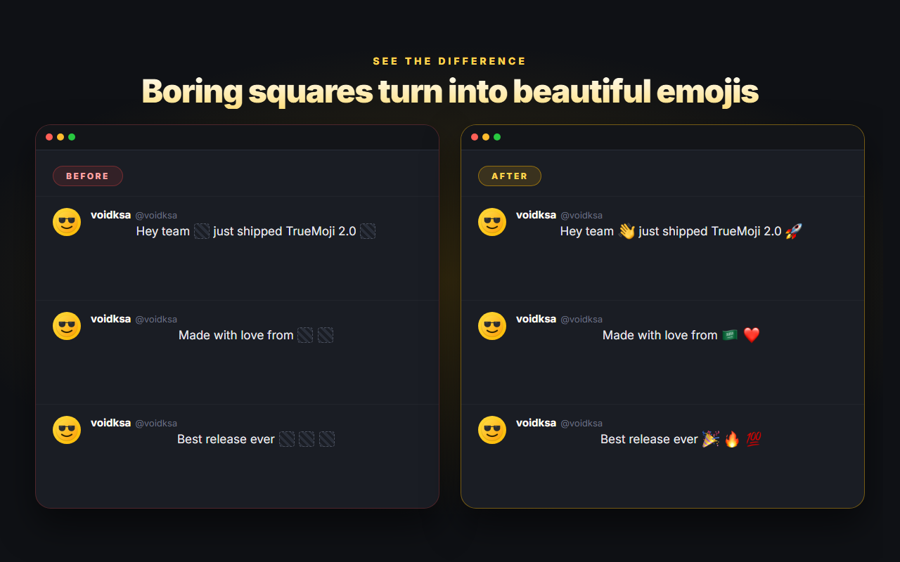
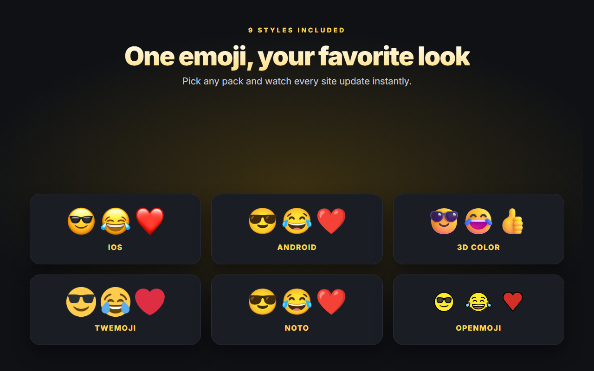
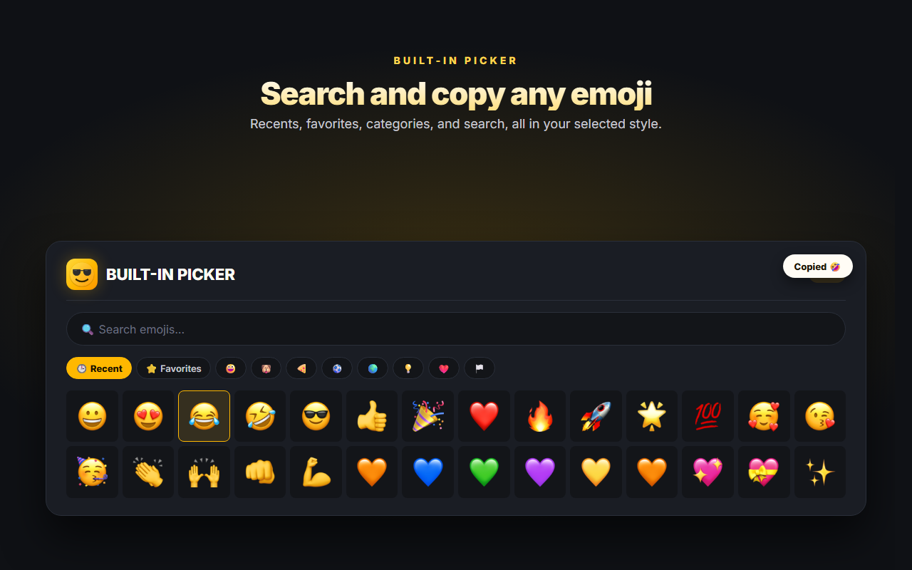

  
   

  
  
  

  <a href="README_ar.md">🇸🇦 العربية</a>

 

Tired of boring default browser emojis? Empty squares where flags should be? **TrueMoji is the solution.**

TrueMoji replaces native system emojis with beautiful, high quality image sets. Apple, Google Noto, Twemoji 15, Microsoft Fluent (3D and Flat), Twitter, Facebook, and OpenMoji. A consistent, vibrant emoji experience on every website you visit.

## See the difference

## Styles

## Built-in picker

## What's new in 2.0

* 🎨 Brand new design that matches the TrueMoji logo. Warm gold accents on a deep dark surface, with full light mode support.
* 📦 Three new emoji packs: **Twemoji 15**, **Google Noto Color**, and **Microsoft Fluent Flat**, alongside the existing Apple, Google, Fluent 3D, Twitter, Facebook, and OpenMoji.
* 🔍 Built in **emoji picker** with search, categories, recents, and favorites.
* 💾 **Settings backup and restore** as a JSON file.
* ⚡ Pinned CDN versions, smarter pack fallback, fewer broken images.
* 🛠️ First run **onboarding** in three steps: language, pack, and shortcut.

## Features

* Nine image packs plus the system default.
* Per site rules to auto switch packs on certain domains.
* Excluded domains for sites you don't want it on.
* Keyboard shortcut to toggle the extension instantly.
* Show original on hover.
* Emoji size control from 1.0× to 1.5×.
* Strict pack mode (no fallback).
* Auto reload pages when settings change.
* Fully bilingual (English and Arabic).
* Light and dark theme that adapts to your system.

## Install

[Add TrueMoji to Chrome](https://chromewebstore.google.com/detail/truemoji/elcfpmpgobljibnhecmkmpgdmljdfbbg) from the Chrome Web Store.

## Support

If TrueMoji has been useful to you, you can [support the project](https://creators.sa/en/voidksa). It really helps keep development going. 💛

For bug reports, please use the Chrome Web Store reviews or contact the developer through the email listed on the store page.

## Privacy

TrueMoji does not collect any personal data, telemetry, or analytics. The full Privacy Policy ships inside the extension itself: open the options page and click **Privacy** at the bottom, or open `chrome-extension://[id]/PRIVACY.html` directly after install.

## License

MIT, see [LICENSE](LICENSE). Original author: **voidksa**.
