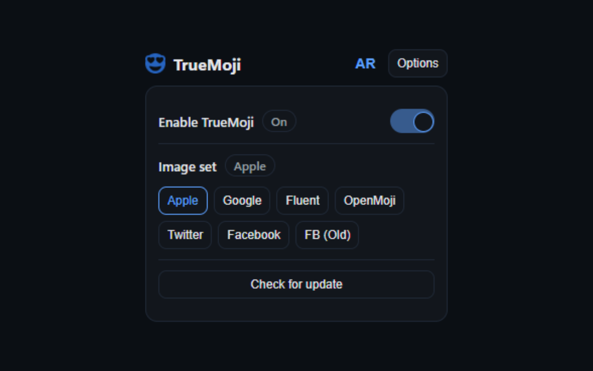
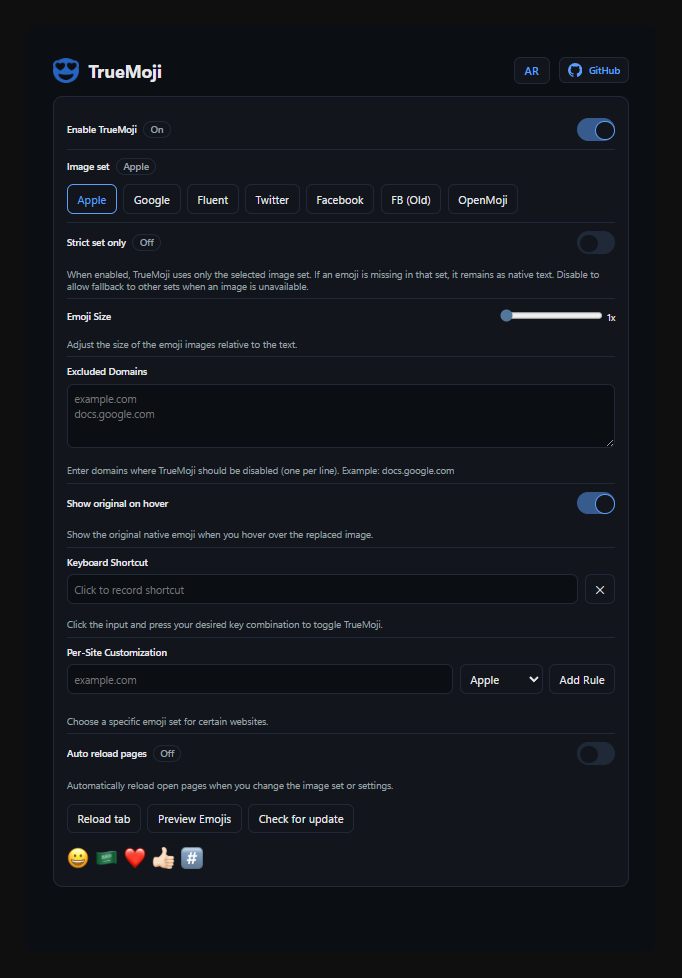

  
   

  
  
  

  <a href="README_ar.md">🇸🇦 العربية</a>

 

Tired of boring default browser emojis? Empty squares where flags should be? **TrueMoji is the solution.**

TrueMoji replaces native system emojis with beautiful, high quality image sets. Apple, Google Noto, Twemoji 15, Microsoft Fluent (3D and Flat), Twitter, Facebook, and OpenMoji. A consistent, vibrant emoji experience on every website you visit.

## See the difference

<table>
  <tr>
    <td align="center"><b>Before</b> (default system)</td>
    <td align="center"><b>After</b> (TrueMoji 2.0)</td>
  </tr>
  <tr>
    <td></td>
    <td></td>
  </tr>
</table>

## Three pillars

| | |
|---|---|
| **Quick switch** | Master toggle, live preview, and a visual pack picker right in the popup. |
| **Emoji picker** | Search, browse, and copy any emoji in your selected pack's style. Recents and favorites are saved automatically. |
| **Full control** | Per site rules, excluded domains, keyboard shortcut, settings export and import, and more. |

## What's new in 2.0.1

* 📓 NotebookLM compatibility for quizzes, flashcards, and delayed Shadow DOM surfaces.
* ✍️ Cleaner editable text fields to avoid duplicate emojis and overlapping input text.
* 🌐 Better coverage for dynamic websites that update text after the page loads.
* 🛡️ Improved image fallback behavior for websites with strict loading policies.
* 📝 The release notes page now appears on first install and whenever a new version is installed.

## Features

* Nine image packs plus the system default.
* Per site rules to auto switch packs on certain domains.
* Excluded domains for sites you don't want it on.
* Keyboard shortcut to toggle the extension instantly.
* Show original on hover.
* Emoji size control from 1.0× to 1.5×.
* Strict pack mode (no fallback).
* Auto reload pages when settings change.
* Fully bilingual (English and Arabic).
* Light and dark theme that adapts to your system.

## Install

[Add TrueMoji to Chrome](https://chromewebstore.google.com/detail/truemoji/elcfpmpgobljibnhecmkmpgdmljdfbbg) from the Chrome Web Store.

## Support

TrueMoji updates take time to test across real websites. If it has been useful to you, support through [Creators](https://creators.sa/en/voidksa) or [Buy Me a Coffee](https://buymeacoffee.com/voidksa) helps keep compatibility fixes and emoji improvements moving.

For bug reports, please use the Chrome Web Store reviews or contact the developer through the email listed on the store page.

## Privacy

TrueMoji does not collect any personal data, telemetry, or analytics. The full Privacy Policy ships inside the extension itself: open the options page and click **Privacy** at the bottom, or open `chrome-extension://[id]/PRIVACY.html` directly after install.

## License

MIT, see [LICENSE](LICENSE). Original author: **voidksa**.
