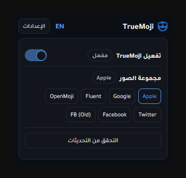

  
  <h1>TrueMoji</h1>

  

مللت من إيموجيات المتصفح التقليدية؟ أو تعاني من عدم ظهور بعض الرموز مثل الأعلام؟ **TrueMoji هو الحل.**

تقوم هذه الأداة باستبدال إيموجيات النظام المملة بمجموعات صور عالية الجودة مثل إيموجيات الآيفون (Apple)، جوجل، تويتر وغيرها. استمتع بتجربة إيموجي كاملة وجميلة في كل المواقع التي تتصفحها.

## شاهد الفرق
| قبل (النظام الافتراضي) | بعد (TrueMoji - نمط Apple) |
|:---------------------:|:--------------------------:|
|  |  |

## المميزات
- **مجموعات إيموجي متعددة**: اختر بين Apple و Google و Twitter و Facebook و OpenMoji و Fluent Design.
- **الوضع الصارم**: فرض استخدام المجموعة المختارة فقط.
- **إعادة التحميل التلقائي**: تحديث الصفحات تلقائياً عند تغيير الإعدادات.
- **ثنائي اللغة**: واجهة معربة بالكامل (إنجليزي وعربي).
- **المعاينة**: تجربة عرض الإيموجي مباشرة في صفحة الإعدادات.

## لقطات الشاشة

### الإعدادات السريعة (الواجهة)

### صفحة الإعدادات

## التثبيت
1. حمل آخر إصدار (ملف `.zip`) من [صفحة الإصدارات](https://github.com/voidksa/TrueMoji/releases/latest).
2. فك ضغط الملفات.
3. افتح متصفح Chrome أو Edge واذهب إلى `chrome://extensions`.
4. فعل "وضع المطور" (Developer mode) في الأعلى.
5. اضغط على "تحميل إضافة غير مضغوطة" (Load unpacked) واختر المجلد.

## الدعم والمساعدة
إذا واجهت أي مشاكل أو لديك اقتراحات، يرجى فتح تذكرة على GitHub:
[الإبلاغ عن مشكلة](https://github.com/voidksa/TrueMoji/issues)

## الخصوصية (Privacy)
لمعرفة كيفية تعاملنا مع بياناتك، يرجى مراجعة [سياسة الخصوصية](PRIVACY.md).

## الترخيص (License)
هذا المشروع مرخص تحت رخصة [MIT License](LICENSE).
يمكنك عمل فورك (Fork) وتطوير المشروع للأفضل، ولكن **يجب** ذكر الحقوق للمطور الأصلي (**voidksa**) ووضع رابط للمستودع الأصلي [voidksa/TrueMoji](https://github.com/voidksa/TrueMoji).
