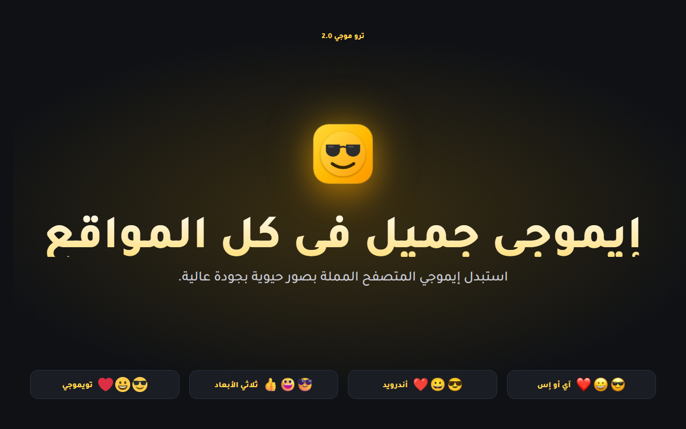
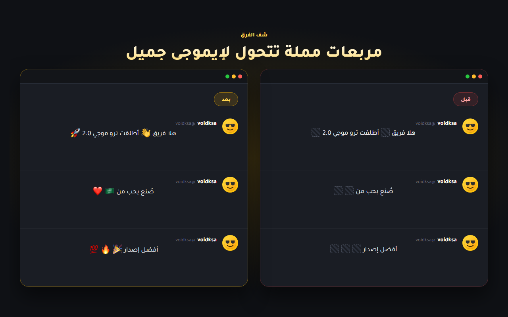
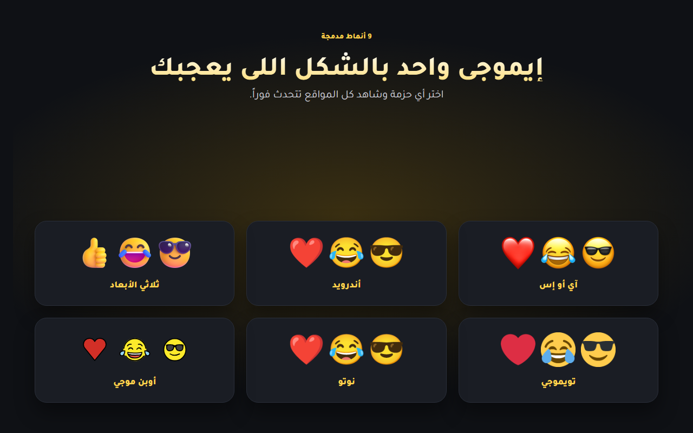
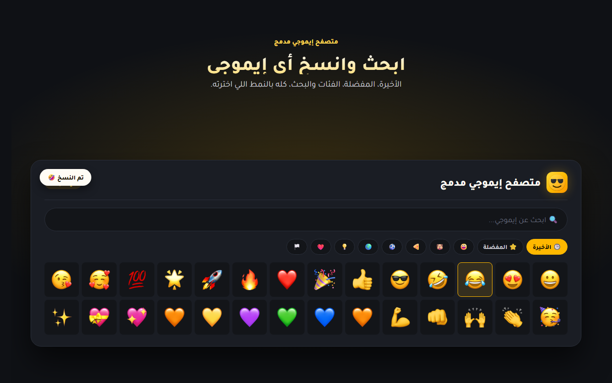

  
   

  
  
  

  <a href="README.md">🇬🇧 English</a>

 

سئمت من إيموجيات المتصفح الأصلية؟ مربعات فارغة بدل الأعلام؟ **TrueMoji هو الحل.**

TrueMoji يستبدل الإيموجي الأصلية للنظام بمجموعات صور عالية الجودة. آبل، جوجل نوتو، تويموجي 15، مايكروسوفت Fluent (3D و Flat)، تويتر، فيسبوك، و OpenMoji. تجربة إيموجي متناسقة وحيوية في كل المواقع التي تزورها.

## شاهد الفرق

## الأنماط

## متصفح الإيموجي المدمج

## الجديد في 2.0

* 🎨 تصميم جديد كلياً يطابق شعار TrueMoji. لمسات ذهبية دافئة على سطح غامق عميق، مع دعم كامل للوضع النهاري.
* 📦 ثلاث حزم إيموجي جديدة: **Twemoji 15**، **Google Noto Color**، و**Microsoft Fluent Flat**، إلى جانب آبل وجوجل و Fluent 3D وتويتر وفيسبوك و OpenMoji.
* 🔍 **متصفح إيموجي** مدمج مع البحث والفئات والأخيرة والمفضلة.
* 💾 **نسخ احتياطي للإعدادات** كملف JSON.
* ⚡ إصدارات CDN مثبتة، رجوع أذكى، صور أقل مكسورة.
* 🛠️ **تجربة ترحيبية** أول مرة في ثلاث خطوات: اللغة، الحزمة، والاختصار.

## المميزات

* 9 حزم صور إضافة للنظام الافتراضي.
* قواعد لكل موقع لتبديل الحزم تلقائياً على نطاقات معينة.
* مواقع مستثناة لتعطيل TrueMoji في مواقع محددة.
* اختصار لوحة المفاتيح لتبديل الإضافة فورياً.
* عرض الإيموجي الأصلي عند التحويم.
* تحكم في حجم الإيموجي من 1.0× إلى 1.5×.
* وضع الحزمة الصارم (بدون رجوع).
* إعادة تحميل تلقائي للصفحات عند تغيير الإعدادات.
* ثنائي اللغة بالكامل (عربي وإنجليزي).
* وضع نهاري وليلي يتكيف مع نظامك.

## التثبيت

[إضافة TrueMoji إلى كروم](https://chromewebstore.google.com/detail/truemoji/elcfpmpgobljibnhecmkmpgdmljdfbbg) من سوق كروم.

## الدعم

إذا كان TrueMoji مفيداً لك، يمكنك [دعم المشروع](https://creators.sa/ar/voidksa). هذا يساعد كثيراً في استمرار التطوير. 💛

للإبلاغ عن مشكلة، استخدم تقييمات الإضافة في سوق كروم أو تواصل مع المطور عبر الإيميل المسجّل في صفحة الإضافة.

## الخصوصية

TrueMoji لا يجمع أي بيانات شخصية أو تحليلات أو تتبع. سياسة الخصوصية الكاملة مدمجة داخل الإضافة نفسها: افتح صفحة الإعدادات واضغط **Privacy** في الأسفل، أو افتح `chrome-extension://[id]/PRIVACY.html` مباشرة بعد التثبيت.

## الترخيص

MIT، اطلع على [LICENSE](LICENSE). المؤلف الأصلي: **voidksa**.

