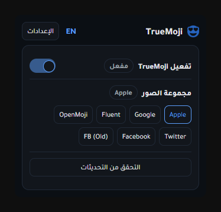
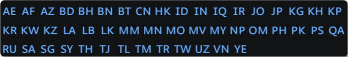
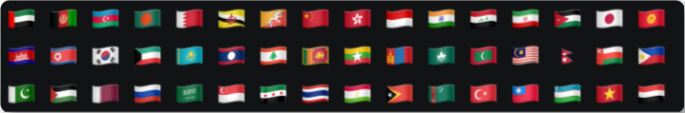
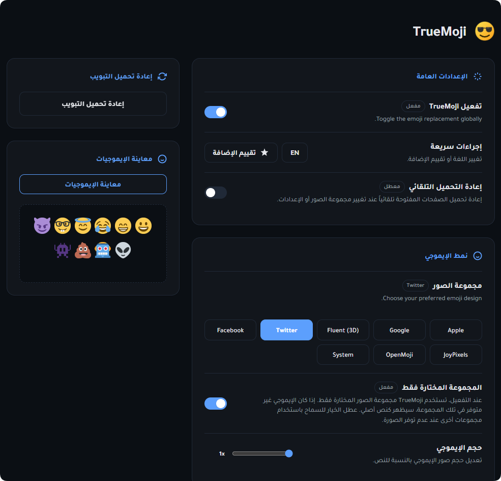

  
   

  
  
  

  <a href="README.md">🇬🇧 English</a>

 

سئمت من إيموجيات المتصفح الأصلية؟ مربعات فارغة بدل الأعلام؟ **TrueMoji هو الحل.**

TrueMoji يستبدل الإيموجي الأصلية للنظام بمجموعات صور عالية الجودة. آبل، جوجل نوتو، تويموجي 15، مايكروسوفت Fluent (3D و Flat)، تويتر، فيسبوك، و OpenMoji. تجربة إيموجي متناسقة وحيوية في كل المواقع التي تزورها.

## شاهد الفرق

<table>
  <tr>
    <td align="center"><b>قبل</b> (النظام الافتراضي)</td>
    <td align="center"><b>بعد</b> (TrueMoji 2.0)</td>
  </tr>
  <tr>
    <td></td>
    <td></td>
  </tr>
</table>

## ثلاث ركائز

| | |
|---|---|
| **تبديل سريع** | مفتاح التفعيل، معاينة فورية، ومتصفح حزم بصري داخل الـpopup. |
| **متصفح إيموجي** | ابحث وتصفح وانسخ أي إيموجي بنمط الحزمة المختارة. الأخيرة والمفضلة محفوظة تلقائياً. |
| **تحكم كامل** | قواعد لكل موقع، نطاقات مستثناة، اختصار لوحة المفاتيح، تصدير واستيراد الإعدادات وأكثر. |

## الجديد في 2.0.1

* 📓 دعم NotebookLM داخل الاختبارات والبطاقات التعليمية وأجزاء Shadow DOM التي تظهر متأخرة.
* ✍️ إصلاح حقول الكتابة لتجنب تكرار الإيموجيات وتداخلها مع النص.
* 🌐 تغطية أفضل للمواقع الديناميكية التي تحدّث النص بعد تحميل الصفحة.
* 🛡️ تحسين مسار تحميل الصور في المواقع التي تستخدم سياسات تحميل صارمة.
* 📝 صفحة سجل التغييرات تظهر الآن عند أول تثبيت وعند تثبيت أي إصدار جديد.

## المميزات

* 9 حزم صور إضافة للنظام الافتراضي.
* قواعد لكل موقع لتبديل الحزم تلقائياً على نطاقات معينة.
* مواقع مستثناة لتعطيل TrueMoji في مواقع محددة.
* اختصار لوحة المفاتيح لتبديل الإضافة فورياً.
* عرض الإيموجي الأصلي عند التحويم.
* تحكم في حجم الإيموجي من 1.0× إلى 1.5×.
* وضع الحزمة الصارم (بدون رجوع).
* إعادة تحميل تلقائي للصفحات عند تغيير الإعدادات.
* ثنائي اللغة بالكامل (عربي وإنجليزي).
* وضع نهاري وليلي يتكيف مع نظامك.

## التثبيت

[إضافة TrueMoji إلى كروم](https://chromewebstore.google.com/detail/truemoji/elcfpmpgobljibnhecmkmpgdmljdfbbg) من سوق كروم.

## الدعم

تحديثات TrueMoji تحتاج وقتاً في الاختبار على مواقع فعلية. إذا كانت الإضافة مفيدة لك، فالدعم عبر [Creators](https://creators.sa/ar/voidksa) أو [Buy Me a Coffee](https://buymeacoffee.com/voidksa) يساعد على استمرار إصلاحات التوافق وتحسينات الإيموجي.

للإبلاغ عن مشكلة، استخدم تقييمات الإضافة في سوق كروم أو تواصل مع المطور عبر الإيميل المسجّل في صفحة الإضافة.

## الخصوصية

TrueMoji لا يجمع أي بيانات شخصية أو تحليلات أو تتبع. سياسة الخصوصية الكاملة مدمجة داخل الإضافة نفسها: افتح صفحة الإعدادات واضغط **Privacy** في الأسفل، أو افتح `chrome-extension://[id]/PRIVACY.html` مباشرة بعد التثبيت.

## الترخيص

MIT، اطلع على [LICENSE](LICENSE). المؤلف الأصلي: **voidksa**.

